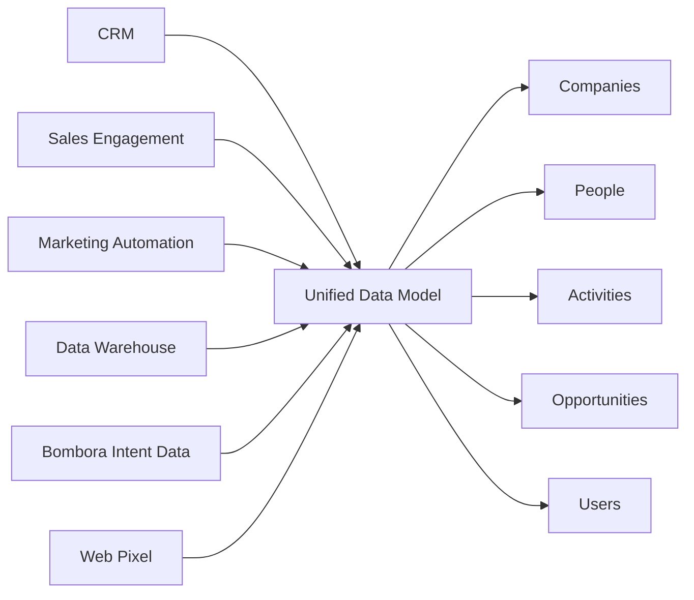

Seam connects to your CRM, sales engagement tools, marketing automation platforms, data warehouses, and intent data sources, then consolidates everything into a unified data model. This gives you a single source of truth across all your GTM systems.

## How it works

When you connect data sources to Seam, we automatically:
1. **Ingest** data from each connected system
2. **Deduplicate** records across sources
3. **Enrich** with additional context and signals
4. **Unify** into five core datasets

This happens continuously—Seam syncs data every few hours so your unified view is always up to date.

## The five core datasets

<CardGroup cols={1}>
  <Card title="Companies" icon="building">
    Unified company dataset
    
    All account-level data including firmographics, technographics, fit scores, intent signals, and engagement history.
  </Card>
  
  <Card title="People" icon="users">
    Unified people dataset
    
    All contact-level data including role, seniority, engagement activities, and buying committee membership.
  </Card>
  
  <Card title="Activities" icon="chart-line">
    Unified activity dataset
    
    All engagement activities including website visits, email opens, meeting attendance, content downloads, and ad interactions.
  </Card>
  
  <Card title="Opportunities" icon="sack-dollar">
    Unified opportunity dataset
    
    All deal data including stage, value, close date, and attribution to campaigns and touchpoints.
  </Card>
  
  <Card title="Users" icon="user-tie">
    Unified users dataset
    
    Your internal team members including reps, marketers, and their account assignments and territories.
  </Card>
</CardGroup>

## Data flow

Here's how data flows from your sources into the unified model:

## Key benefits

<AccordionGroup>
  <Accordion title="Single source of truth" icon="database">
    No more conflicting data across systems. Seam resolves duplicates and creates one unified record for each company and person.
  </Accordion>
  
  <Accordion title="Automatic enrichment" icon="sparkles">
    Seam enriches your unified data with intent signals, fit scores, and AI research—giving you more context than any single source provides.
  </Accordion>
  
  <Accordion title="Constantly updated data" icon="arrows-rotate">
    Changes in your CRM or other systems sync to Seam every few hours, and Seam pushes enriched data back to your tools.
  </Accordion>
  
  <Accordion title="Cross-system intelligence" icon="brain">
    Connect activities across systems. See which accounts engaged with ads, visited your website, and received outreach—all in one place.
  </Accordion>
</AccordionGroup>

